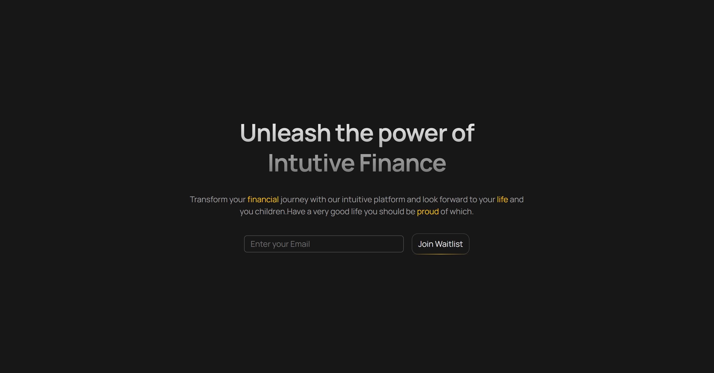

# PROJECT ABOUT THEMES AND LAYOUT

## Made a Hero Component

- Learned how to use width and what width you need and height when designing Hero Section

- Learned how to clip text to background using a linear gradient in the bg.
  (bg-clip-text =
  👉 Background ko text ke shape ke hisaab se kaat do
  👉 Background sirf letters ke andar dikhao)

- used some subtle design under the button (learned about inset,bottom,left,rightand left and when to -bottom-px and -top-px and added gradient here with the div given some height).

- learned about themeing in general (eg.

  @theme {
  --color-primary: oklch(85.2% 0.199 91.936);
  })

  then how to easily use it anywhere -- super useful.

- same as theme can be done for anything like fonts , spacing everything can be tweeked using span , very useful and looks very professional -> follows the DRY principal.

## Added the screenshot here!

